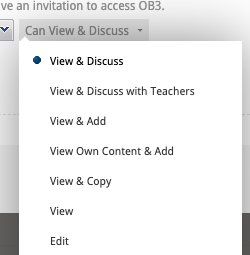
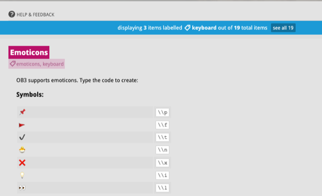

# OB3 S2 2024 updates

#### 8th August 2024

## **New sharing mode: DISCUSS WITH TEACHERS**

We’ve added a new sharing mode for discussions, called Discuss with Teachers.  

In this sharing mode: each student can **create a discussion but can only see their own posts**, **and any replies from teachers**

- Teachers (more precisely: users with a higher privilege like Edit, Add or View and Discuss) can see all discussions
- Students will only receive notifications for their own discussions, while teachers will get notifications for all discussions
- You can change a document to View and Discuss to “open up” the discussions so that everyone can see all discussions

Access this sharing mode in the usual way from the Sharing and Permissions screen:

Discuss with teachers can be used for activities such as:

- **allow students to contribute first before discussing with each other**. Start by selecting View and Discuss with Teachers, then later when you want to open the conversation up, change to View and Discuss
- **for surveys or other situations where you want to get feedback or responses from each student**
- **sharing content with large diverse groups of users (e.g. all staff in organisation, alumni, all students in a Department)**

## **EMOJI support in text editing**

We’ve added support for using emojis in OB3.  You can type emoji codes (such as :-) for 😊).  As you type the recognised text will be replaced with the emoji.  

- Supported emojis are documented in the Keyboard help section (press F1, or click the Keyboard icon at bottom right of OB3).  
- Note: you can use emojis in file and course names as well as in document content.  
- Please let us know if there is a desirable emoji missing from our set and we can add it in future updates.

### **Accessibility enhancements to keyboard navigation**

As part of ongoing work to make OB3 fully accessible, we are releasing improved keyboard navigation in this release.

The new keyboard commands allow a user to:

- Navigate between file manage and any opened OB3 documents, using OPTION + SHIFT + LEFT or RIGHT keys
- Navigate document content, including navigating between headings, using OPTION + OPTION + UP or DOWN keys
- Access OB3 buttons using the keyboard, including: Table of contents (OPTION + SHIFT + T) or OB3 Search (OPTION + SHIFT + F)

Click F1 key or keyboard help icon at bottom right of OB3 to see all keyboard shortcuts.

**BUG FIXES**

This release includes an a number of refinements and bug fixes including improvements to media transcoding.

# OB3 S1 2024 updates

#### March 13th 2024

### Updates to OB3 password reset and policies

- OB3 password reset screen has had design improvements
- We've updated the password policies for OB3 to require stronger passwords, and more "diverse" passwords - so using easy to guess words or phrases in your password will not be allowed
  - FYI OB3 stores your password in an encrypted format - we don't know or store the plain text of your password in our systems (and we'll never ask you for your password)

### Updates to OB3 Cookies

- We've implemented updates to OB3 cookies to improve privacy, and support updates to Google Chrome browser that prevent cookies from being able to "track" users between sites (while OB3 doesn't do this, we've had to update our app to support newer and more private ways of using cookies that are now required by Google)

#### Bug fixes and minor updates (March)

- fixed a bug to support pasting of underlined styled text
- removed support for pasting "file://" protocol links - which may mistakenly result in a user pasting a URL reference to a file on their computer
- we've stopped using Google Analytics within OB3

## Security enhancements (February)

- improvements to OB3 security with measures for detection and mitigation against DDoS attacks and [OWASP top 10](https://owasp.org/www-project-top-ten/) attacks amongst others.  
- Further details available to enterprise customers.

### Add support for OB3 styles - MS Word

OB3 now supports importing content that has been styled using Word style sheets.  

A template Word document is available at the following URL which contains the styles and instructions on how to use [https://www.ob3.io/downloads/ob3-word-stylesheet/ob3-word-stylesheet-example.zip](https://ob3.intercom-clicks.com/via/e?ob=WSuPJyUYGuQJFle753UGGLoKE2B0xMaQNGknKgoPURKGv9BvjbY9SPUTYBkbeAoEloAC%2FG04iMAxrv7b%2FfVDGcxdXt4EUUxHj5hXRf9br7czJubf%2FCl2LBg56rqLE4zm&h=460be1efa34215ea32a185d054d3c8a91331fc55-fhbhwljd_14446200013722&l=63de03b3e1b59cf9dcca37c3a233f5a6c5c9bc7d-96205953).

You can copy paste or drag/drop content from Word to OB3.  Create the following styles in MS Word Style pane and apply to your content in Word:

- question
- answer
- quote
- important
- announcement
- citation (or reference)
- caption

When you copy content to OB3 it will be styled using the corresponding OB3 paragraph styles.

Academic staff who have joined a course via LMS (Moodle, Canvas) will receive automated message via email Teacher onboarding in Intercom.

## Improvements to video loading

OB3 now shows a progress indicator when large videos are being loaded.  The initial delay occurs as video is copied into the CDN.

#### Bug fixes and minor updates

- fixed a bug that prevented underlined text from being copied correctly
- MS Word Title style is now recognised as heading level 1 in OB3
- OB3 quote style is now not italicised
- improvements to logging
- ob3 copy paste now recognises underlined text correctly
- pasting file:// protocol links is disabled: ob3 will now not hyperlink file protocol links - to prevent users from hyperlinking to files on their own computer that are not on the web

# OB3 S2 2023 updates 

### Major release work in progress

- design and development work continues this semester on OB3's next major feature release.  Further details will be released Q1 2024

### Updates to Cloud hosting

- all OB3 hosted Cloud files (file attachments, images, embedded media etc) are now stored in Sydney Australia.  Previously some assets were stored in London UK.

### Updated the Media Catalog report

- updated this report to work with an updated csv library
- this report will export all media used within a page (or folder, or course) in a variety of formats.  It can be used to export media embeds from OB3 for re-use in an LMS (for example to embed OB3 hosted videos in Canvas LMS)

### Support enhancement - Intercom - email users who only login once after seven days

- sent after 7 days if the user has only one session in OB3.  This message is just to ensure that user did not have a problem logging in or accessing their course content 
- message sent via email

### Edit and Share enhancements for instructors

- when sharing a course via LTI the default privilege for Instructors (teachers) is Edit and Share.  This privilege will allow teachers to modify sharing on content within a course without having to access the PMA (Dept) account where course sharing is setup.  
  - The intention of this privilege is to allow the OB3 co-ordinator (or trained staff within a Department) to undertake OB3 course rollovers and setup, while allowing teachers to be able to modify course sharing on content without having to have access to the PMA (Departmental) account.
  
- Today's enhancement improves the teacher UX for Edit and Share by:
  - preventing Instructors from (typically accidentally) deleting Learner or Instructor groups, which are required for correct LTI course sharing operation, from their teacher account.  These groups now appear without the "x" delete option. 
  - hide groups which cannot be configured by the teacher from their account. Teachers must use the PMA account if they wish to adjust LTI course groups.  This means a teacher may sometimes see that a course has 3 groups but when viewing the course the groups may not appear.  If groups are not visible in the sharing dialog, this means they need to be edited in the PMA account.
  - Teachers can modify sharing within the course - for example allowing a student to have edit rights on a document or folder.  Teachers can create their own groups and use with course sharing. This provides the flexibility required for various collaborative activities and portfolio cases of use that OB3 supports.

### Release notes website

- added this release notes (what's new) website, where details of OB3 updates will be posted.

### Bug fixes

- fixed a bug that prevented some images in old OB3 documents (migrated from OB3 version 1 prior to 2015) from displaying correctly.

- fixed a bug in the media catalog report

- add additional tests to ensure that account has all required information for proceeding with login - to address an edge case of user attempting to login with an invalid account (missing email or OB3 userID data).  User will be prompted to contact support and login will abort to login screen on account failure.

- when using OB3 clipboard if you cut and paste feature to move content within the same document sometimes pasted content would sometimes appear in wrong position. 

  

- you can use the link button in the OB3 sidebar to obtain a URL pointing to specific content in a document (for example a specific discussion or heading, ie a deep link).  Fixed a bug where this UX element would not hide after use. 

- update cut paste logic when used to cut a list item (or items) from within a list and paste as paragraph.  Previously would "alias" the pasted paragraph instead of pasting it which we do not support.

### Sharing and Permissions design update

- updated the design of the Sharing and permission dialog.  This now appears as a modal window. 
- added a red close button at top right to visually distinguish from the sharing privileges - this is to help prevent users from accidentally deleting shares when trying to close dialog
- added button bar at bottom including a new Help button that goes to sharing topics on guide.ob3.io website.  Additional help articles will be posted there

### Updates to LTI course sharing

- previously when sharing a course to LTI only one gruop was added to the sharing dialog (the LTI course group).  Now we add three groups, the course group, the instructor and the learner group.  This ensures that teachers can view learner and instructor details easily by clicking the hyperlinks on the corresponding group to view membership.  It also ensures that privileges set are more explicitly visible
- disable LTI will remove the LTI parent group and prevent new users joining the course, but teacher must manually delete learner and instructor group if access to existing users to be disabled.  This allows alumni to continue to access course content.

### Record Instructor status and Department (Programme) on LTI launch

- updated OB3 intercom to record the Department a user is studying in when user joins a course via LTI.  This enables clients to request a per-department breakdown of users who have joined courses via LTI.  Note we typically only retain intercom active users for 45 days, so this will provide a breakdown of users active in the last 45 days.

- record whether user is an instructor.  This tag will be used to provide instructor onboarding campaign to introduce teachers progressively to OB3.  Topics will be added to guide.ob3.io website and introduced to teachers through Intercom email and in-app messages.

### Table editing update

- updated Table editing commands to visually separate (with divider lines)  Remove options from Insert operations.  This is to further help users avoid accidentally deleting column elements when they don't intend this

### Azure post-migration updates

- system updates to OB3 after our first week in operation on Azure Cloud

### Bug fixes

- fixed a bug in video and audio transcoding to ensure that we don't check uploads in progress that are more than 7 day.

- fixed a bug in the password reset screen
- updated Slack logging to ensure only critical logging events are sent to slack
- updates to logging and monitoring
- forbid operations that would ever add a component into itself

# Major update: OB3 Azure Cloud release

- this update deployed on Sunday July 2nd
- OB3 code base has been restructureded into packages, in preparation for supporting the next major OB3 feature release
- Migrate OB3 Cloud files to Sydney region
- OB3 data and services migrated to Sydney Australia data region
- OB3 delivered as a containerised (docker) application running under Azure App Service and Azure Cassandra as Managed Service database
- improvements to application monitoring and logging
- security enhancements
- application performance and scalability enhancements
- improvement resilience, with easy ability to deploy OB3 in different geographical regions, or to support dedicated OB3 instances for Enterprise customers
- improved developer workflows allowing faster release of enhancements and updates
- migrate OB3 custom elearn apps such as the Virtual Ophthalmic Clinic web app to Azure and deployed in Sydney region

# OB3 S1 2023 Updates

Check back later for further updates in this section

### Table Deletion warnings

- Student portfolios in OB3 use tables extensively.  These enhancements are designed to help students avoid accidentally deleting tables or columns
- show warning dialog and ask user to confirm when attempting to delete a table with many cells.  
- show warning dialog and ask user to confirm when user attempts to delete a column from a table containing many cells.  

### Add keyboard command support for common document editing operations

- add support for changing style of paragraphs from keyboard.  
- add support for changing paragraph to list (option + L) or table (option + T) from keyboard.  The list command is particularly helpful when using lists extensively
- update OB3 keyboard help map (accessible via the keyboard icon at the bottom right of OB3)

### Update Copy to Clipboard features

- Update "Copy to clipboard" buttons throughout OB3 to use modern browser copy methods.  Buttons now correctly copy content (such as URLs) to clipboard

### Remove Flash support

- remove legacy code from OB3 (and OB3 application build processes) related to supporting Flash content.  Please note if you have educational content that uses Flash we are able to support this using the Ruffle flash player.  Please contact help@ob3.io for assistance

### Preparing OB3 for deploying to the Azure Cloud

- tasks ongoing over the last year (2022-23) and are too extensive to list here
- extensive testing in Azure App service since November 2022
- testing and documentation of application migration process
- development and updating of operations documentation

### Set document name when navigating OB3 content

- when navigating OB3 content change the browser window title to match the content being viewed.  Supports updates for navigating courses and folders, and for documents opened.
- Note that by recording this inforrmation browser history will now show your navigation through OB3 content allowing students to return to content they have previously viewed (note: if using Chrome Incognito window you may need to re-enable history recording which is disabled by default)

### Add Privacy Policy and Terms of Service acceptance screen

- add startup screen for new users to view and accept terms of service and privacy policy agreements

### Enterprise customer updates

- a number of tasks were completed for enterprise customers in this period, details ommitted here for client privacy reasons

### Miscellaneous updates

- update wording on OB3 new account activation email - sent to users who are invited to OB3 via email
- update OB3 password reset policy to reject passwords that are too insecure
- update code for detecting Grammerly browser extension and disabling in OB3.  OB3 (in common with many other editing apps) does not support Grammarly as it interferes with content editing.
- disable pasting images or file attachments into lists or tables
- update database connection logic to more reliably handle database socket connection timeouts